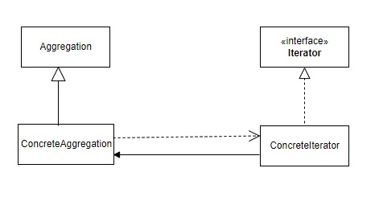

# 使用時間
Iterator Pattern 可以讓我們循序獲得集合物件，且將獲取集合的方式封裝起來。  
又可分成Internal Iterator與External Iterator。  
Internal iterator 指在類別中就有提供方法可以依序獲得集合物件。
# 如何使用

# JDK Example
• java.util.Iterator  
• java.util.Enumeration