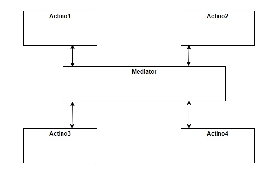

# 使用時間
當一組物件彼此有相互的關聯，為避免物件中互相引用，加入一個中間層解藕彼此的關係，用來封裝一組物件的互動方式。
# 如何使用

# JDK example
## java.util.concurrent.ScheduledExecutorService (all scheduleXXX() methods)
## java.util.concurrent.ExecutorService (the invokeXXX() and submit() methods)
## java.util.concurrent.Executor#execute()
## java.util.Timer (all scheduleXXX() methods)
## java.lang.reflect.Method#invoke()