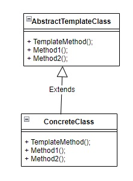

# 使用時間
TemplateMethodPattern在介面定義了一個演算法的框架，可將演算法分成若干步驟。  
再讓subclass決定這些步驟實際實行細節，如此可以將低重複的程式碼。

# 如何使用

#JDK Example
• java.util.Collections#sort()  
• java.io.InputStream#skip()  
• java.io.InputStream#read()  
• java.util.AbstractList#indexOf()