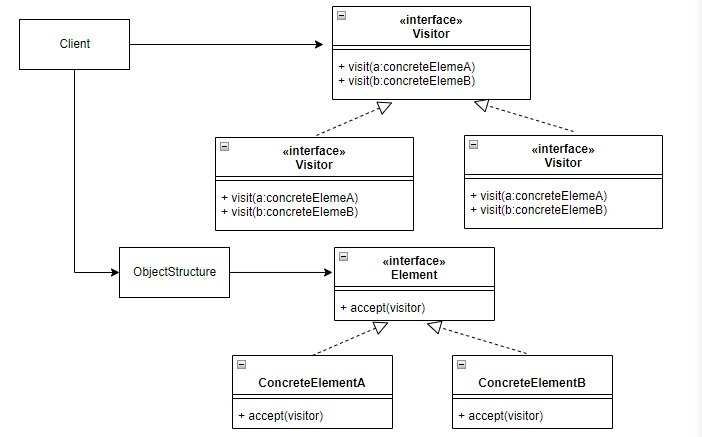

# 使用時間
VisitorPattern 可以將物件的操作從類別中抽離，如果要新增新的操作可以免於修改類別，符合開閉原則。  
且對於異質性的資料特別有用，免於instanceOf的使用。
# 如何使用

#JDK Example
• javax.lang.model.element.Element and javax.lang.model.element.ElementVisitor  
• javax.lang.model.type.TypeMirror and javax.lang.model.type.TypeVisitor