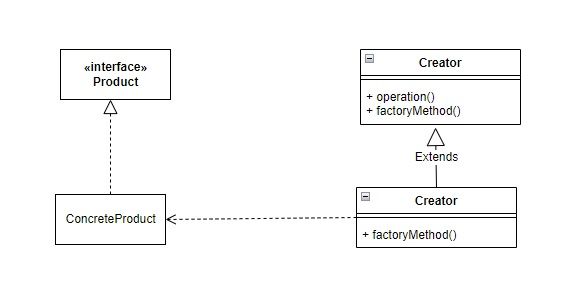

# 使用時間  
FactoryMethod Pattern 可以將真正物件創立細節封裝起來，在編寫程式碼時，不用指名特定的物件來創立，並切將物件創立的任務交由factory class 的 subclass來完成。
# 如何使用
  

# JDK Example
•java.util.Calendar#getInstance()
• java.util.ResourceBundle#getBundle()
• java.text.NumberFormat#getInstance()
• java.nio.charset.Charset#forName()
• java.net.URLStreamHandlerFactory#createURLStreamHandler(String) (Returns singleton object per
protocol)
