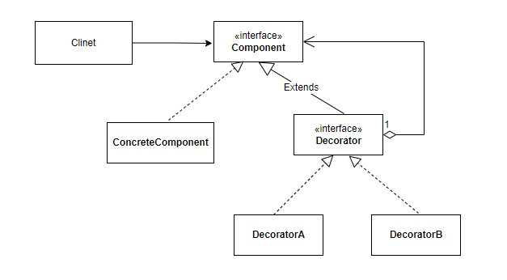

# 使用時間
裝飾類別跟被裝飾物件實作相同的介面，且裝飾類別內擁有被裝飾物件。當請求到達被裝飾物件時，裝飾類別會先實作某些功能。  
如此可以避免再被裝飾物件內寫過多的邏輯，且能動態修正物件行為。
# 如何使用

# JDK example
• java.io.BufferedInputStream(InputStream)
• java.io.DataInputStream(InputStream)
• java.io.BufferedOutputStream(OutputStream)
• java.util.zip.ZipOutputStream(OutputStream)
• java.util.Collections#checked[List|Map|Set|SortedSet|SortedMap]()