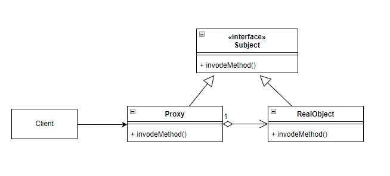

# 使用時間
在ProxyPattern中，client不直接與物件溝通，而是通過代理來進行溝通。  
根據代理的目的Proxy Pattern 可分為 Remote Proxy, Virtual Proxy,and Protection Proxy等 ...  
1.Remote Proxy :可用來遠端調用物件 。  
2.Virtual Proxy: 達成lazy initialization的目的，避免一開始就創建昂貴的物件。  
3.Protection Proxy:用來控制物件的存取權。  

# 如何使用
